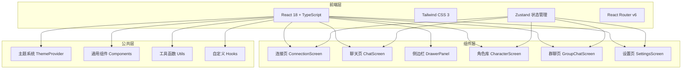
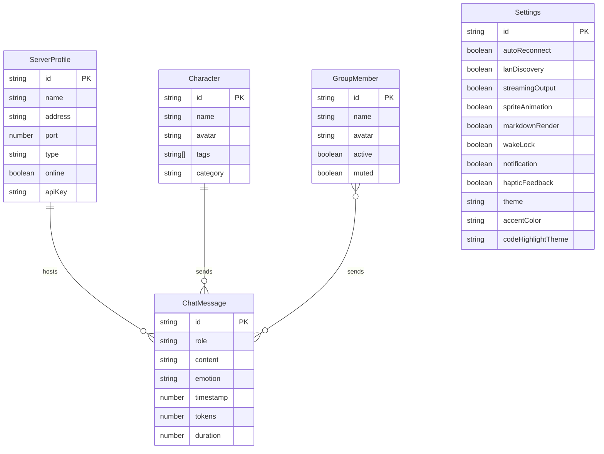

## 1. 架构设计



## 2. 技术说明

- **前端框架**：React 18 + TypeScript + Vite
- **初始化工具**：vite-init (react-ts 模板)
- **样式方案**：Tailwind CSS 3 + CSS Variables 主题系统
- **状态管理**：Zustand（轻量级，适合移动端场景）
- **路由**：React Router v6（HashRouter，兼容 PWA 部署）
- **图标库**：lucide-react
- **后端**：无（纯前端，通过 WebSocket/REST 连接 SillyTavern 服务器）
- **数据库**：无（使用 localStorage/IndexedDB 进行本地缓存）

## 3. 路由定义

| 路由 | 用途 |
|------|------|
| / | 连接页 - 服务器发现与连接管理 |
| /chat | 聊天页 - AI 对话核心界面 |
| /characters | 角色库 - 角色浏览与管理 |
| /group | 群聊页 - 多角色群聊 |
| /settings | 设置页 - 应用配置 |

## 4. API 定义

本项目为纯前端应用，不包含后端 API。所有数据交互通过以下方式实现：

- **SillyTavern 服务器通信**：WebSocket（流式输出）+ REST API（角色/对话管理）
- **本地存储**：localStorage 存储用户配置、服务器列表等
- **Mock 数据**：开发阶段使用模拟数据展示界面效果

## 5. 服务器架构图

不适用（纯前端项目）

## 6. 数据模型

### 6.1 数据模型定义



### 6.2 数据定义

```typescript
interface ServerProfile {
  id: string;
  name: string;
  address: string;
  port: number;
  type: 'lan' | 'cloud' | 'tunnel';
  online: boolean;
  apiKey?: string;
}

interface Character {
  id: string;
  name: string;
  avatar: string;
  tags: string[];
  category: string;
}

interface ChatMessage {
  id: string;
  role: 'user' | 'ai';
  content: string;
  emotion?: string;
  timestamp: number;
  tokens?: number;
  duration?: number;
}

interface GroupMember {
  id: string;
  name: string;
  avatar: string;
  active: boolean;
  muted: boolean;
}

interface AppSettings {
  autoReconnect: boolean;
  lanDiscovery: boolean;
  streamingOutput: boolean;
  spriteAnimation: boolean;
  markdownRender: boolean;
  wakeLock: boolean;
  notification: boolean;
  hapticFeedback: boolean;
  theme: 'dark' | 'light';
  accentColor: string;
  codeHighlightTheme: string;
}
```
